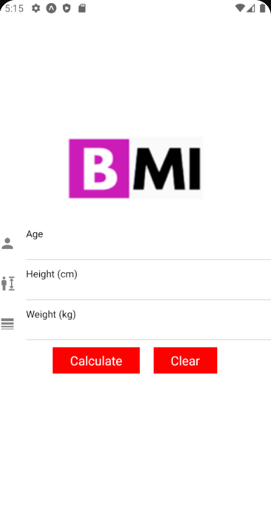
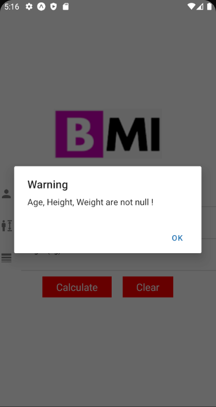
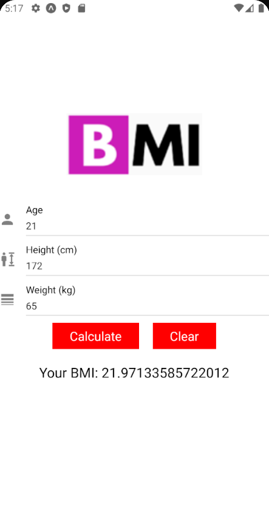

 

# Calculate-BMI-App-By-React-Native

 Find its Github repo  <a href='https://github.com/phungminhhieu1206/Calculate_BMI_ReactNative'>here</a>

## Demo

<h4 align="center">Home Screen &nbsp&nbsp&nbsp&nbsp | &nbsp&nbsp&nbsp&nbsp Alert Screen &nbsp&nbsp&nbsp&nbsp | &nbsp&nbsp&nbsp&nbsp Result Screen</h4>

## Run project locally

* clone this Repository by `git clone https://github.com/phungminhhieu1206/Calculate_BMI_ReactNative.git`.
* Change directory `cd Calculate_BMI_ReactNative`
* Make sure you have expo-cli installed. If not run `npm install -g expo-cli`
* Install the dependencies using `npm install`
* Run `npm start`
* Then type in terminal `a` to run on android emulator, `i` to run on ios simulator.

For more info read `https://reactnative.dev/docs/getting-started`